<div align="center">
  
</div>

<p align="center">
  <a href="https://erikdev.cc"></a>
  <a href="https://github.com/Erik0318?tab=repositories"></a>
</p>

<p align="center">
  <strong>I build focused software with a little personality.</strong><br />
  Local-first AI tools, browser utilities, unusual interfaces, and computers made from logic gates.
</p>

## `~/about`

```text
erik@dev:~$ whoami
builder / experimenter / relentless debugger

erik@dev:~$ current-focus
shipping useful ideas across the web ↔ hardware boundary

erik@dev:~$ principles
fast > bloated  ·  local > invasive  ·  finished > perfect
```

## `~/featured`

<table>
  <tr>
    <td width="50%" valign="top">
      <h3>🎬 <a href="https://github.com/Erik0318/Letterboxd-AI-Review">Letterboxd AI Review</a></h3>
      <p>Local-first Letterboxd analytics with deep reports and AI-powered taste notes.</p>
      <code>React</code> <code>TypeScript</code> <code>Cloudflare</code>
    </td>
    <td width="50%" valign="top">
      <h3>⏱️ <a href="https://github.com/Erik0318/TempoPilot">TempoPilot</a></h3>
      <p>A tiny, framework-free browser extension for controlling any HTML5 video's speed.</p>
      <code>JavaScript</code> <code>WebExtensions</code> <code>Manifest V3</code>
    </td>
  </tr>
  <tr>
    <td width="50%" valign="top">
      <h3>🧠 <a href="https://github.com/Erik0318/tang25k-cpu">Tang25K CPU</a></h3>
      <p>A 16-bit computer built from scratch for the Sipeed Tang Primer 25K FPGA.</p>
      <code>Verilog</code> <code>FPGA</code> <code>Computer Architecture</code>
    </td>
    <td width="50%" valign="top">
      <h3>🌐 <a href="https://github.com/Erik0318/HomePage">erikdev.cc</a></h3>
      <p>My corner of the web: projects, experiments, and the things I am learning.</p>
      <code>Web</code> <code>Design</code> <code>Indie Hacking</code>
    </td>
  </tr>
</table>

## `~/toolbox`

<p align="center">
  
  
  
  
  
  
  
  
</p>

<details>
  <summary><strong>What I like building</strong></summary>
  <br />

  - Products that do one thing exceptionally well
  - Local-first experiences that respect the user
  - Interfaces with strong visual identity
  - Systems where software meets real hardware
</details>

<br />

<div align="center">
  
  <sub>Make it useful. Make it fast. Make it memorable.</sub>
</div>
