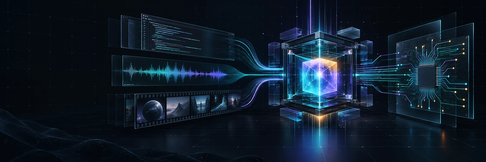

  
   
  

  
  

  I make <strong>small, opinionated software</strong> and occasionally disappear down a hardware rabbit hole. 
  Native media tools, local-first web apps, browser utilities, and a 16-bit computer built from logic gates.

  <code>fast over bloated</code>&nbsp;&nbsp;•&nbsp;&nbsp;<code>local over invasive</code>&nbsp;&nbsp;•&nbsp;&nbsp;<code>finished over perfect</code>

 

<table>
  <tr>
    <td width="58%" valign="top">
      <h3><code>~/signal</code></h3>
      <pre>
ROLE       builder / experimenter / debugger
DOMAIN     software ↔ media ↔ hardware
BIAS       useful, fast, memorable
CURRENT    shipping Suture
SIDE QUEST films, music, low-level CS/EE</pre>
    </td>
    <td width="42%" valign="top">
      <h3><code>~/now</code></h3>
      
<strong>Suture</strong> is a local-first native app that stitches ordered audio tracks into one continuous file or static-cover video.

      
It bundles its own media tools and ships for Linux, Windows, and macOS.

      
<a href="https://github.com/Erik0318/Suture"><strong>inspect the build →</strong></a>

    </td>
  </tr>
</table>

## `01 // selected builds`

<table>
  <tr>
    <td width="50%" valign="top">
      DESKTOP · LOCAL FIRST
      <h3>🪡 <a href="https://github.com/Erik0318/Suture">Suture</a></h3>
      
Stitches albums, mixes, live recordings, and audio CDs into continuous audio or static-cover video—with real progress, chapters, CUE sheets, and no system FFmpeg required.

      
<code>Rust</code> <code>egui</code> <code>FFmpeg</code> <code>Cross-platform</code>

    </td>
    <td width="50%" valign="top">
      WEB · PRIVACY FIRST
      <h3>🎞️ <a href="https://github.com/Erik0318/Letterboxd-AI-Review">Letterboxd AI Review</a></h3>
      
Turns a Letterboxd export into deep, local analytics and optional AI taste notes—with no account, database, or mandatory data retention.

      
<code>React</code> <code>TypeScript</code> <code>Cloudflare</code> <code>Data viz</code>

      
<a href="https://filmstats.erikdev.cc/">launch app ↗</a>

    </td>
  </tr>
  <tr>
    <td width="50%" valign="top">
      HARDWARE · FROM SCRATCH
      <h3>🧠 <a href="https://github.com/Erik0318/tang25k-cpu">Tang25K CPU</a></h3>
      
A personal 16-bit computer taking shape on the Sipeed Tang Primer 25K FPGA—where the abstraction ends and the gates begin.

      
<code>Verilog</code> <code>FPGA</code> <code>CPU design</code> <code>Digital logic</code>

    </td>
    <td width="50%" valign="top">
      BROWSER · 15 KB OF FOCUS
      <h3>⏱️ <a href="https://github.com/Erik0318/TempoPilot">TempoPilot</a></h3>
      
Keyboard-first speed control for any HTML5 video. Framework-free, cross-browser, rebindable, and smart enough to find the video you actually mean.

      
<code>JavaScript</code> <code>WebExtensions</code> <code>Manifest V3</code>

    </td>
  </tr>
</table>

  
<strong>One more weird interface...</strong>

   
  
<a href="https://github.com/Erik0318/Twigoo"><strong>Twigoo</strong></a> is a command-only, text-first forum prototype: no buttons, visible composer boxes, images, or icons—just a prompt and a language of commands.

## `02 // operating principles`

<table>
  <tr>
    <td width="33%" valign="top">
      <h3>◈ Local by default</h3>
      
If computation can happen on your machine, it probably should.

    </td>
    <td width="34%" valign="top">
      <h3>⌁ Sharp interfaces</h3>
      
Tools should have a point of view—and stay out of the way once learned.

    </td>
    <td width="33%" valign="top">
      <h3>⚡ Learn underneath</h3>
      
From React state to CPU state: follow the abstraction until it becomes real.

    </td>
  </tr>
</table>

## `03 // working set`

  

  
  
  
  
  

## `04 // signal map`

  

 

  
  <strong>Build the thing. Learn what is underneath. Ship the better version.</strong> 
  <a href="https://erikdev.cc">erikdev.cc</a> · <a href="https://github.com/Erik0318?tab=repositories">all repositories</a>

