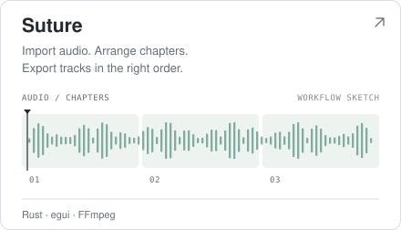
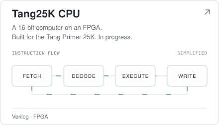
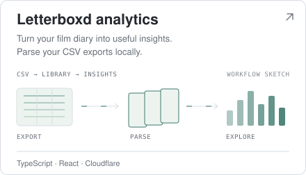
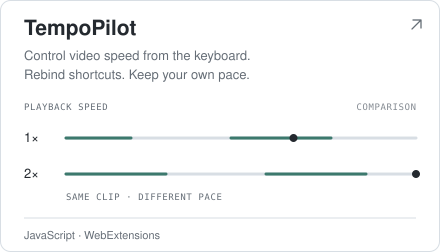

# Welcome!!

[erikdev.cc ↗](https://erikdev.cc) · [Repositories](https://github.com/Erik0318?tab=repositories) · 

<!-- profile:start -->
<picture>
  <source media="(prefers-color-scheme: dark)" srcset="./assets/snake-dark.svg" />
  
</picture>

### Selected work

  <a href="https://github.com/Erik0318/Suture"><picture>
    <source media="(prefers-color-scheme: dark)" srcset="./assets/project-suture-dark-2433ba64b14b.svg" />
    
  </picture></a>
  <a href="https://github.com/Erik0318/tang25k-cpu"><picture>
    <source media="(prefers-color-scheme: dark)" srcset="./assets/project-tang25k-cpu-dark-05398e271519.svg" />
    
  </picture></a>

  <a href="https://github.com/Erik0318/Letterboxd-AI-Review"><picture>
    <source media="(prefers-color-scheme: dark)" srcset="./assets/project-letterboxd-ai-review-dark-3ace1a662c51.svg" />
    
  </picture></a>
  <a href="https://github.com/Erik0318/TempoPilot"><picture>
    <source media="(prefers-color-scheme: dark)" srcset="./assets/project-tempopilot-dark-84f99f1d40d4.svg" />
    
  </picture></a>

Project details &amp; latest releases

**[Suture](https://github.com/Erik0318/Suture)** — Cross-platform audio app: CD import, ordered track export, chapters, and bundled FFmpeg.

Rust · egui · FFmpeg · [v1.0.0](https://github.com/Erik0318/Suture/releases/tag/v1.0.0) · 2026-07-10

**[Tang25K CPU](https://github.com/Erik0318/tang25k-cpu)** — A 16-bit computer built for the Tang Primer 25K FPGA. In progress.

Verilog · FPGA · No stable release yet

**[Letterboxd analytics](https://github.com/Erik0318/Letterboxd-AI-Review)** — Parses Letterboxd exports locally into film analytics, reports, and optional AI taste notes.

TypeScript · React · Cloudflare · No stable release yet

**[TempoPilot](https://github.com/Erik0318/TempoPilot)** — Keyboard-driven video speed control with rebindable shortcuts and automatic video selection.

JavaScript · WebExtensions · No stable release yet

### Activity

<picture>
  <source media="(max-width: 600px) and (prefers-color-scheme: dark)" srcset="./assets/stats-dark-mobile.svg" />
  <source media="(max-width: 600px)" srcset="./assets/stats-light-mobile.svg" />
  <source media="(prefers-color-scheme: dark)" srcset="./assets/stats-dark.svg" />
  
</picture>

[Data](./docs/activity.md) · [↻ 6h](https://github.com/Erik0318/Erik0318/actions/workflows/profile.yml) · 2026-10-07 06:33 PDT

<!-- profile:end -->
