# Welcome!! 

  

<!-- profile:start -->
<a href="https://erik0318.github.io/Erik0318/" aria-label="Open Signal Garden, an interactive sculpture playground">
  <picture>
    <source media="(max-width: 600px) and (prefers-color-scheme: dark)" srcset="./assets/scene-dark-mobile.svg" />
    <source media="(max-width: 600px)" srcset="./assets/scene-light-mobile.svg" />
    <source media="(prefers-color-scheme: dark)" srcset="./assets/scene-dark.svg" />
    
  </picture>
</a>

⌘ Playground controls &amp; field notes

Open [Signal Garden](https://erik0318.github.io/Erik0318/), then move your pointer to bend the strands, drag to rotate, or click to send a ripple. Keys **1–4** change the sculpture, **Space** pauses, and **R** resets the orbit. On touchscreens, drag sideways or tap. The tempo slider changes the speed.

Each form comes from a project below: **Resonance** folds a waveform into a knot, **Architecture** builds a circuit lattice, **Afterimage** twists a ribbon through space, and **Momentum** bends an orbit. Reduced-motion preferences start the playground paused and stop the README animation.

<picture>
  <source media="(prefers-color-scheme: dark)" srcset="./assets/snake-dark.svg" />
  
</picture>

  <a href="https://github.com/Erik0318/Suture"><picture>
    <source media="(prefers-color-scheme: dark)" srcset="./assets/project-suture-dark.svg" />
    
  </picture></a>
  <a href="https://github.com/Erik0318/tang25k-cpu"><picture>
    <source media="(prefers-color-scheme: dark)" srcset="./assets/project-tang25k-cpu-dark.svg" />
    
  </picture></a>

  <a href="https://github.com/Erik0318/Letterboxd-AI-Review"><picture>
    <source media="(prefers-color-scheme: dark)" srcset="./assets/project-letterboxd-ai-review-dark.svg" />
    
  </picture></a>
  <a href="https://github.com/Erik0318/TempoPilot"><picture>
    <source media="(prefers-color-scheme: dark)" srcset="./assets/project-tempopilot-dark.svg" />
    
  </picture></a>

<picture>
  <source media="(max-width: 600px) and (prefers-color-scheme: dark)" srcset="./assets/stats-dark-mobile.svg" />
  <source media="(max-width: 600px)" srcset="./assets/stats-light-mobile.svg" />
  <source media="(prefers-color-scheme: dark)" srcset="./assets/stats-dark.svg" />
  
</picture>

[Data](./docs/activity.md) · [↻ 6h](https://github.com/Erik0318/Erik0318/actions/workflows/profile.yml) · 2026-09-29 10:31 PDT
<!-- profile:end -->
